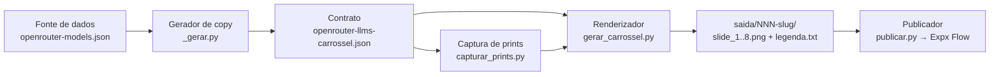

# Carrosséis em lote com IA sem gastar tokens

**Academia do Código · Metodologias de Thulio Bittencourt · setembro de 2026**

Explicação técnica da estrutura usada na série "LLMs do OpenRouter que viram receita para software house": 418 carrosséis de 8 slides, produzidos em lote, sem uma única chamada a modelo de linguagem na hora de produzir.

---

## Enquadramento

| Item | Definição |
|---|---|
| Marca | Academia do Código. O leitor sai sabendo o que construir. |
| Leitor | Dev, líder técnico ou dono de software house que produz conteúdo para vender. |
| Área do DNA | Aquisição (principal). Tecnologia e IA (secundária). |
| Problema percebido | "Gerar conteúdo com IA custa caro e sai inconsistente." |
| Problema real | Usar o modelo de linguagem na hora errada: na produção de cada peça, em vez de na construção do sistema que produz as peças. |
| Tese em uma frase | Token se gasta uma vez, para escrever o gerador. Depois, o gerador escreve as peças a custo zero. |
| Consequência empresarial | Uma série de centenas de peças com custo marginal zero, identidade estável e revisão possível em código. |

**Estado das afirmações:** tudo o que está aqui foi lido no código-fonte e nos arquivos de saída da série. Nenhum comando foi executado nesta sessão. Os números são contagens de arquivos e valores de configuração, não medições de desempenho.

---

## 1. A tese: token na construção, não na produção

Existem dois jeitos de usar IA para produzir uma série de carrosséis.

**Jeito 1: o modelo escreve cada peça.** Para cada item da série, você manda um prompt, o modelo devolve a copy, alguém revisa, alguém diagrama. Funciona para dez peças. Para quatrocentas, o custo cresce em linha reta, a consistência cai, e cada correção de regra exige regerar tudo.

**Jeito 2: o modelo escreve o sistema que escreve as peças.** Você gasta tokens uma vez, numa sessão de trabalho com o assistente, para construir três programas: um que transforma dados em copy, um que captura provas, um que transforma copy em imagem. Depois disso, gerar 418 carrosséis ou 4.180 custa o mesmo: zero em inferência, alguns minutos de CPU.

A série do OpenRouter usou o jeito 2. Este documento descreve como.

O que se ganha:

- **Custo marginal zero.** Regenerar a série inteira depois de uma correção não custa tokens.
- **Identidade estável.** A identidade visual mora no gerador e nunca muda de peça para peça. O que muda é só a copy, que mora no JSON.
- **Determinismo.** O mesmo item sempre recebe a mesma frase. Regenerar não muda nada por acidente.
- **Revisão em código.** Uma regra de copy errada se corrige em um lugar e vale para toda a série.

O que se paga:

- **A variação tem o tamanho dos pools.** O sistema só escreve o que alguém escreveu antes nos pools de frases. Pool pequeno vira repetição visível.
- **Fonte de dados obrigatória.** Sem catálogo estruturado com atributos que decidam a copy, não há lote.

---

## 2. O que a série produziu

| Medida | Valor | De onde vem |
|---|---|---|
| Modelos na fonte de dados | 437 | dump da API do OpenRouter |
| Descartados (aliases e roteadores) | 19 | regra de exclusão no gerador |
| Carrosséis gerados | 418 | itens no JSON de copy |
| Slides por carrossel | 8 | anatomia fixa |
| PNGs finais | 3.344 | 418 × 8 |
| Prints de prova capturados | 1.672 | 4 por carrossel |
| Tamanho do JSON de copy | 3 MB | arquivo gerado |
| Formato | 1080 × 1350 | 4:5 do feed |
| Chamadas a modelo de linguagem na produção | 0 | não há cliente de API em nenhum dos três scripts |

---

## 3. Arquitetura em cinco estágios



Cada estágio tem uma responsabilidade e um único artefato de saída. Nenhum estágio conhece o interior do outro: eles conversam pelo JSON e pela pasta de saída.

| Estágio | Entrada | Saída | Responsabilidade |
|---|---|---|---|
| 1. Fonte | API pública | JSON bruto | Atributos que decidem a copy |
| 2. Gerador de copy | JSON bruto | JSON de copy | Classificar, escolher frases, montar 8 slides |
| 3. Prints | JSON de copy | 4 PNGs por item | Prova visual de cada afirmação |
| 4. Renderizador | JSON de copy + prints | 8 PNGs por item | Identidade, encaixe, cor por item |
| 5. Publicador | PNGs + JSON | post agendado + automação | Hospedar, agendar, vincular DM |

---

## 4. Estágio 1: a fonte de dados

O lote começa num catálogo, não numa ideia. A série usou o dump da API de modelos do OpenRouter. Cada registro traz o que a copy precisa para decidir o que dizer:

- `pricing.prompt` e `pricing.completion`: preço por token, como string.
- `architecture.input_modalities` e `output_modalities`: o que o modelo lê e devolve.
- `context_length`: tamanho da janela.
- `description`: texto do fabricante.
- `canonical_slug`: base da URL pública.

**Regra:** a fonte precisa ter atributos que mudem a copy. Um catálogo de nomes não serve. Se dois itens têm os mesmos atributos, eles vão receber a mesma copy, e isso é correto: a variação tem que vir de diferença real, não de sorteio.

O que a IA faz aqui: lê a estrutura do JSON bruto e propõe quais campos viram eixos de classificação. O que a IA não faz: inventar atributos que a fonte não tem.

---

## 5. Estágio 2: o gerador de copy

Este é o programa que substitui o modelo de linguagem na produção. Ele tem quatro partes.

### 5.1 Eixos de classificação

Cada item é colocado em dois eixos. O primeiro é o **tier de preço**, calculado pela média entre prompt e completion por milhão de tokens:

```python
def classify_tier(model):
    pricing = model.get("pricing") or {}
    prompt = float(pricing.get("prompt", "0")) * 1_000_000
    completion = float(pricing.get("completion", "0")) * 1_000_000
    if prompt == 0 and completion == 0:
        return "free"
    avg = (prompt + completion) / 2
    if avg < 0.30:
        return "barato"
    if avg < 2.00:
        return "medio"
    return "caro"
```

O segundo é a **modalidade**, decidida pela arquitetura declarada e, em último caso, por palavras no id e na descrição:

```python
def classify_modality(model):
    arch = model.get("architecture") or {}
    inputs = arch.get("input_modalities") or []
    outputs = arch.get("output_modalities") or []
    blob = (model["id"] + " " + model.get("description", "")).lower()
    if "image" in outputs and "text" not in outputs:
        return "imagem"
    if "audio" in outputs and "text" not in outputs:
        return "audio"
    if "image" in inputs:
        return "visao"
    if "video" in inputs:
        return "video"
    if "code" in blob or "coder" in blob:
        return "codigo"
    return "texto"
```

Dois eixos com quatro e seis valores dão 24 combinações possíveis. Cada combinação recebe seu pool de frases. Isso é o que faz a copy parecer escrita para aquele modelo sem ter sido.

### 5.2 Uma tese por tier

Cada tier tem uma única tese, e os oito slides pagam a promessa que o gancho faz:

| Tier | Tese |
|---|---|
| free | Feature de IA a custo zero. Margem integral na entrega. |
| barato | Custo de centavos por milhão de tokens. A margem recorrente mora na diferença entre custo e mensalidade. |
| medio | Produtividade. A hora do time volta para o que vende. |
| caro | Entrega crítica com modelo de elite. Cliente paga pelo resultado, não pelo token. |

Sem essa amarração, o slide 5 promete uma coisa e o slide 8 outra. Com ela, a série inteira fala uma coisa só por tier, com vocabulário de software house: proposta, módulo, setup, mensalidade, margem.

### 5.3 Pools de frases e escolha determinística

Cada slide de cada combinação tem um pool de duas a dez variações. A escolha não é aleatória: é um hash do id do modelo.

```python
import hashlib

def stable_pick(model_id, options):
    """Mesmo modelo, mesma escolha, sempre."""
    return options[hashlib.md5(model_id.encode("utf-8")).digest()[0] % len(options)]
```

Um pool tem esta forma. Cada opção carrega o texto e a lista de trechos que o renderizador vai destacar:

```python
opts = [
    (f"Cliente pede IA no sistema e o orçamento não cobre a API. {name} resolve: roda de graça.",
     ["roda de graça"]),
    (f"Seu concorrente já cobra por um módulo de IA. {name} te deixa entregar igual, sem custo de API.",
     ["sem custo de API"]),
    (f"Feature de IA sem gastar 1 centavo de API: {name} é grátis, o custo que sobra é a tua hora de integrar.",
     ["1 centavo de API", "grátis"]),
]
texto, negrito = stable_pick(model["id"], opts)
```

**Por que hash e não sorteio:** regenerar a série depois de corrigir um slide não pode mudar os outros sete. Com `random`, cada execução embaralha tudo e a revisão feita ontem se perde. Com hash, o item 001 recebe a mesma frase hoje, amanhã e depois de qualquer correção que não toque no pool dele.

**Tamanho do pool é decisão de produto.** A série cometeu o erro de ter um único exemplo de cena para modelos de visão. O resultado: 254 dos 418 carrosséis diziam "foto da nota fiscal" no slide 3. A correção foi um pool de dez cenas por modalidade, cobrindo setores diferentes de cliente: nota fiscal, print de erro, currículo em PDF, canteiro de obra, contrato, planta baixa, boleto, exame médico, etiqueta de estoque. Regra prática: pool menor que oito opções, numa série com centenas de itens, vira repetição que o leitor nota.

### 5.4 Conexão entre slides por construção

O gancho sempre termina no nome do modelo. O slide 2 sempre abre com "Esse é o {modelo}". A ligação entre a capa e a explicação não depende de o pool estar bem escrito: está garantida pela forma dos templates. O mesmo vale para o slide 4, cujos bullets nascem do tier e da modalidade, e para o slide 8, que reafirma a promessa do tier antes do CTA fixo.

### 5.5 Anatomia fixa dos oito slides

| Slide | Função | O que carrega | Print |
|---|---|---|---|
| 1 | gancho | Dor concreta de software house que termina no modelo | não |
| 2 | o_que_e | Define, dá contexto, desarma a objeção técnica | sim |
| 3 | pratica | Cena de uso por modalidade e consequência da tese | sim |
| 4 | o_que_vender | Bullets que viram linha de proposta | não |
| 5 | como_cobrar | Monetização que fecha a conta do gancho | não |
| 6 | openrouter | Preço real por milhão de tokens e link | sim |
| 7 | benchmark ou prova_social | Número real com leitura por faixa, ou ficha técnica | sim |
| 8 | cta | Promessa do tier + CTA fixo com palavra-chave | não |

A função é o campo que o renderizador lê para escolher qual layout montar. Copy e layout se encontram nesse campo, e só nele.

### 5.6 O contrato: o JSON de copy

O gerador escreve um JSON que é o contrato entre os estágios. Um item, resumido:

```json
{
  "id": 1,
  "nome_curto": "Ling 3.0 Flash VL (free)",
  "provider": "inclusionai",
  "provider_color_hex": "#2460FC",
  "provider_color_fonte": "avatar oficial no Hugging Face",
  "modalidade": "visao",
  "tier_preco": "free",
  "pricing": { "prompt": "0", "completion": "0" },
  "context_length": 262144,
  "tem_reasoning": true,
  "template": "light",
  "slides": [
    { "n": 1, "funcao": "gancho", "texto": "...", "negrito": ["1 centavo de API", "grátis"], "print": null },
    { "n": 2, "funcao": "o_que_e", "texto": "...", "negrito": ["..."], "print": "tela do produto ou site oficial" },
    { "n": 4, "funcao": "o_que_vender", "texto": "...", "bullets": ["...", "..."], "print": null }
  ],
  "legenda": "...",
  "mensagem_direct": "...",
  "legenda_revisada": true,
  "automation": {
    "keywords": ["LLM"],
    "mensagem": "Oi {nome_usuario}! Aqui está o livro gratuito ...",
    "link": "https://...",
    "public_reply_enabled": true,
    "public_reply_text": "Te chamei no direct!"
  }
}
```

Três decisões nesse contrato importam mais que as outras:

- **`negrito` é uma lista de trechos, não marcação no texto.** O renderizador acha o trecho e aplica a cor de acento. A copy fica limpa e revisável.
- **`print` é uma descrição, não um caminho.** O estágio de prints decide onde buscar; o renderizador só confere se o arquivo existe.
- **`template` alterna claro e escuro pelo id.** Ímpar claro, par escuro. O feed não fica monótono e ninguém precisa decidir isso item a item.

O bloco `meta` do JSON guarda as regras de copy em texto: tese por tier, regra de conexão, o que é obrigatório em cada slide. Quem abrir o arquivo daqui a seis meses entende por que a copy é assim sem abrir o código.

---

## 6. Estágio 3: captura de prints

Copy sem prova é opinião. A série exige quatro prints por carrossel: a tela do produto, a funcionalidade, o preço na página do OpenRouter e o benchmark.

O script de captura:

- Abre o browser headless em lotes, captura, fecha tudo, repete. Browser aberto por horas vaza memória.
- Para cada print, tenta uma **cadeia de URLs alternativas** até uma responder 200. Site oficial, depois model card no Hugging Face, depois a página do OpenRouter.
- Checa HTTP antes de abrir a página. Nenhum print de 404, 403 ou timeout fica no disco.
- Recorta com PIL, por slide, com margem nas bordas.
- Tem um modo de recheck que apaga prints cuja URL morreu.

**Regra herdada de séries anteriores:** se o slide pede print no JSON, o print tem que existir antes de publicar. O renderizador avisa e renderiza só texto, o que serve para ajustar copy, não para postar.

Detalhes que só aparecem fazendo: página do OpenRouter sem o sufixo `:free` mostra o preço pago de um modelo gratuito. Card de preço com valor promocional fora de pico contradiz a copy. Site que bloqueia headless obriga a usar o model card. Cada um desses virou linha no guia da série.

---

## 7. Estágio 4: o renderizador

É aqui que copy vira imagem. O renderizador monta HTML, abre no Chromium via Playwright, mede, ajusta e tira o screenshot em 1080 × 1350.

### 7.1 A identidade mora no CSS

Um único bloco de CSS carrega a série inteira: fontes, fundos, cards, faixa, rodapé. Os temas são variáveis:

```css
.post.claro{--bg:#F5F1E9;--card:#FFFFFF;--txt:#1B1714;--muted:#6B6358; ...}
.post.escuro{--bg:#141210;--card:#1A1613;--txt:#F1EBE1;--muted:#A69D8F; ...}
.hl{color:var(--acc)}
```

Cada função de slide tem uma função Python que devolve HTML. O mapa é direto:

```python
BUILD = {
    "gancho": html_gancho,
    "o_que_e": html_o_que_e,
    "pratica": html_pratica,
    "o_que_vender": html_o_que_vender,
    "como_cobrar": html_como_cobrar,
    "openrouter": html_openrouter,
    "benchmark": html_prova,
    "prova_social": html_prova,
    "cta": html_cta,
}
```

**Regra:** um elemento visual novo entra na função do slide e no CSS, nunca no JSON de um post só. Se precisa de um campo novo, ele entra no contrato e vale para todos.

### 7.2 Uma cor por item, com contraste garantido

A série tem uma variação deliberada: a cor de acento de cada carrossel é a cor de marca do provider. OpenAI verde, Anthropic preto, Mistral laranja. A cor vem do JSON, com fonte e grau de confiança anotados. O renderizador só a ajusta para legibilidade:

```python
def paleta_provider(item, tema):
    rgb = _hex_rgb(item["provider_color_hex"])
    bg = _hex_rgb("#F5F1E9" if tema == "claro" else "#141210")
    alvo = (0, 0, 0) if tema == "claro" else (255, 255, 255)
    t, adj = 0.0, rgb
    while contraste(adj, bg) < 3.0 and t < 1.0:
        t += 0.05
        adj = _mix(rgb, alvo, t)          # mistura com preto ou branco, sem trocar o matiz
    onacc = "#FFFFFF" if contraste(adj, (255,255,255)) >= contraste(adj, (20,18,16)) else "#141210"
    return _rgb_hex(adj), onacc
```

Preto da Anthropic no tema escuro seria invisível. O algoritmo clareia até 3:1 e para. A cor do texto sobre o acento é escolhida pelo maior contraste. Quando o provider não tem cor registrada, cai num laranja de fallback e o log avisa. A regra da série é não publicar com o aviso: descobrir a cor e registrar.

### 7.3 Encaixe automático: o browser mede, o código não adivinha

Este é o mecanismo que faz o lote funcionar sem revisão slide a slide. Depois de montar o HTML, um trecho de JavaScript roda dentro da página e devolve a lista do que estourou:

```javascript
() => {
  const bad = [];
  const post = document.querySelector('.post');
  if (post.scrollHeight > 1350 + 1) bad.push('slide estourou a altura');
  const card = document.querySelector('.card');
  if (card && card.scrollHeight > card.clientHeight + 1) bad.push('card estourou');
  const lista = document.querySelector('.lista');
  if (lista && lista.scrollHeight > lista.clientHeight + 1) bad.push('lista estourou');
  // gancho em 5+ linhas, nome em 3 linhas, chips largos, print baixo, título do CTA em 4+ linhas...
  return bad;
}
```

O corpo do slide é multiplicado por um fator `k`. Se algo estourou, `k` encolhe 4 por cento e o slide é montado de novo, até 14 rodadas. Nos slides de card, se sobrou mais de 80 px, `k` cresce 4 por cento por rodada até 1,25, e fica no maior valor que ainda passa:

```python
def renderizar(pg, build, png, cresce=False):
    k = 1.0
    for tentativa in range(14):
        html, bad = _monta(pg, build, k)
        if not bad:
            break
        k = round(k * 0.96, 3)
    if cresce and not bad and k == 1.0:
        while round(k * 1.04, 3) <= 1.25 and pg.evaluate(SLACK) > 80:
            k2 = round(k * 1.04, 3)
            html2, bad2 = _monta(pg, build, k2)
            if bad2:
                html, bad = _monta(pg, build, k)
                break
            k, html = k2, html2
    pg.screenshot(path=str(png), type="png")
    return k
```

O log de cada slide diz o `k` final, e o guia ensina a ler:

| `k` | Significado | Ação |
|---|---|---|
| 1,00 | coube sem ajuste | nenhuma |
| acima de 1,00 | sobrava espaço, o texto cresceu | nenhuma |
| 0,85 a 0,96 | texto ou print grande, encolheu sozinho | nenhuma |
| abaixo de 0,85 | copy comprida ou print alto demais | encurtar a copy ou recortar o print |
| aviso de 14 rodadas | não coube nem encolhendo | encurtar a copy |

É esse número que substitui o olho humano em 3.344 slides. Você não abre todos. Você filtra o log por `k` baixo e abre esses.

### 7.4 Proteções que evitam lote inteiro errado

- **Fonte não carregou, o script para.** Sem rede, o Google Fonts não responde e o Chromium usa fallback. O renderizador checa `document.fonts` e aborta com erro em vez de gerar 3.344 imagens com a fonte errada.
- **Travessão na copy, aviso no log.** Regra da série. Renderiza mesmo assim, mas o checklist manda corrigir antes de postar.
- **Lote reutiliza o browser.** Acima de três itens, abre uma página e renderiza tudo nela. Abrir Chromium por item multiplica o tempo.
- **`--so 2,6` renderiza só alguns slides.** Ajuste rápido sem regerar os oito.
- **`--html` guarda o HTML de cada slide** para inspecionar no browser quando o PNG não explica o problema.

---

## 8. Estágio 5: publicação

O publicador lê o mesmo JSON, sobe os PNGs, cria o carrossel agendado e vincula a automação de DM na mesma chamada da API do Expx Flow. Cada pasta de saída guarda um `uploads.json` com a chave `nome:tamanho:mtime` apontando para a URL hospedada. Rodar de novo não sobe o que já subiu.

O bloco `automation` do JSON define a palavra-chave que o leitor comenta e a mensagem de direct com o link do material gratuito. Isso fecha a esteira: o carrossel é peça de topo, e o CTA leva ao próximo degrau, não ao mais caro.

---

## 9. Onde a IA entra, e onde não entra

| Tarefa | Quem faz | Custo em tokens |
|---|---|---|
| Ler a fonte de dados e propor eixos de classificação | IA, uma vez | sessão de design |
| Escrever os classificadores | IA, uma vez | sessão de design |
| Escrever a tese por tier e os pools de frases | IA com o autor, uma vez | sessão de design, a mais longa |
| Escrever o CSS e as funções de slide | IA, uma vez | sessão de design |
| Escrever as checagens de estouro | IA, uma vez | sessão de design |
| Gerar a copy de 418 itens | gerador | zero |
| Renderizar 3.344 slides | renderizador | zero |
| Capturar 1.672 prints | script de captura | zero |
| Ler o log, achar `k` baixo, ajustar pool ou print | IA com o autor | sessão curta de ajuste |
| Escrever o guia da série | IA | sessão curta |
| Revisar amostra antes de postar | autor | zero |

O padrão de trabalho com o assistente tem três sessões:

1. **Design.** Fonte de dados na mão, você descreve a série: público, tese por eixo, anatomia dos slides, identidade visual. O assistente escreve os três scripts e o contrato. Peça explicitamente: "a identidade mora no gerador; a copy mora no JSON; escolha por hash, nunca por sorteio; o browser mede o estouro".
2. **Ajuste por amostra.** Gere três itens: um claro, um escuro, um de provider com cor difícil. Abra os 24 PNGs. O que estiver errado se corrige no gerador, e as três amostras se regeneram. Repita até os três passarem. Só então gere o lote.
3. **Guia.** O assistente escreve o runbook da série: comandos, anatomia, leitura do log, checklist, problemas conhecidos. Cada problema que apareceu no lote vira uma linha da tabela de sintomas.

O que não pedir ao assistente: gerar a copy de cada item. É o jeito 1 com passos extras.

---

## 10. Como replicar para outra série

1. **Escolha a fonte.** Um catálogo com atributos que mudem a copy. Repositórios do GitHub com estrelas, linguagem e licença. Ferramentas de um marketplace com preço e categoria. Funcionalidades de um produto com módulo e persona.
2. **Defina os eixos.** Dois eixos com três a seis valores cada. Cada combinação recebe uma tese em uma frase. Escreva as teses antes dos pools.
3. **Desenhe o contrato.** Campos do item, anatomia dos slides com função nomeada, lista `negrito`, campo `print` descritivo, `template` alternando, bloco `automation`.
4. **Peça o gerador de copy.** Classificadores, pools por combinação com no mínimo oito opções nos slides que mais aparecem, `stable_pick`, regra de conexão entre gancho e slide 2, bloco `meta` com as regras em texto.
5. **Peça o renderizador.** CSS com temas em variáveis, uma função por função de slide, cor por item com ajuste de contraste, checagens de estouro, loop de `k`, checagem de fonte, lote com browser reutilizado.
6. **Gere três amostras e revise.** Corrija no gerador. Regenere. Repita.
7. **Capture os prints.** Cadeia de URLs, checagem HTTP, recorte com margem. Confira que a cena do slide 3 bate com o print.
8. **Gere o lote.** Filtre o log por `k` abaixo de 0,85 e por avisos. Abra só esses.
9. **Rode o checklist** antes de postar qualquer item.
10. **Publique pelo JSON.** O publicador lê o contrato, não a pasta.

---

## 11. Regras que não se negociam

- A identidade visual mora no gerador. A copy mora no JSON. Nada atravessa os dois além da cor do item.
- Escolha por hash do id. Nunca por sorteio.
- Uma tese por combinação de eixos. Os oito slides pagam a mesma promessa.
- O gancho termina no item. O slide 2 abre com o item.
- Print pedido é print obrigatório antes de publicar.
- O browser mede o estouro. O código não estima.
- Sem fonte carregada, sem geração.
- Elemento visual novo entra no gerador, nunca no JSON de um post.
- Zero travessão na copy. Zero número sem fonte. Zero promessa de resultado.
- Nenhum item publicado com aviso no log.

---

## 12. Erros que a série cometeu

| Erro | Efeito | Correção |
|---|---|---|
| Um exemplo só de cena para modelos de visão | 254 de 418 slides 3 repetiam "nota fiscal" | pool de dez cenas por modalidade, escolhido por hash |
| Mancha de luz posicionada com `bottom` negativo | slide estourava 100 px sem depender de `k` | posicionar sempre com `top` |
| Página do OpenRouter sem sufixo `:free` | print com preço pago em modelo gratuito | capturar a URL com o sufixo |
| Card de preço promocional fora de pico | print contradizia a copy | empilhar cabeçalho com a tabela de providers |
| Contexto de 1.048.576 dividido por mil | "1049k tokens" | múltiplos de 1.048.576 saem como "1M tokens" |
| Catálogo de prints não atualizado após a captura em lote | arquivo diz que 3 itens estão completos, a pasta tem os 1.672 | regenerar o catálogo ao fim de cada captura, ou apagá-lo |
| Cor de texto escurecida sobre fundo escuro nos pills | pill ilegível no tema escuro | usar o acento puro como cor de texto |

Cada linha dessa tabela nasceu de um PNG errado. É por isso que o guia da série tem uma seção de problemas conhecidos: a próxima série não repete o que esta já pagou para aprender.

---

## 13. Consequência empresarial

Uma software house que produz conteúdo para vender tem dois custos: o de criar e o de manter. O jeito 1 baixa o custo de criar e não toca no de manter. O jeito 2 zera os dois depois da construção: a série inteira se regenera com uma correção, o CTA aponta para o próximo degrau da esteira em todas as peças, e a identidade não deriva com o tempo.

O que fica como ativo não é a série de 418 posts. É o gerador. Trocar a fonte de dados e os pools produz a próxima série com o mesmo renderizador, o mesmo publicador e o mesmo checklist.

---

## Estrutura de arquivos da série

```
carrosel-llms/
├── openrouter-models.json               # estágio 1: fonte bruta
├── _gerar.py                            # estágio 2: dados → copy
├── openrouter-llms-carrossel.json       # contrato: 418 itens × 8 slides
├── capturar_prints.py                   # estágio 3: prova visual
├── prints-catalog.json                  # inventário de prints (manter atualizado)
├── gerar_carrossel.py                   # estágio 4: copy → PNG
├── GUIA-CARROSSEL-LLMS.md               # runbook: comandos, log, checklist, problemas
├── assets/logos/<provider>.png          # opcional: logo no slide 2
└── saida/
    └── 001-ling-3-0-flash-vl-free/
        ├── slide_1.png ... slide_8.png  # 1080 × 1350
        ├── slide_N.html                 # só com --html
        ├── legenda.txt
        ├── prints/slide_{2,3,6,7}.png
        └── uploads.json                 # estágio 5: o que já subiu
```
