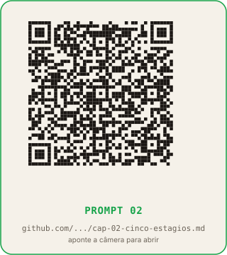

# Capítulo 2: A fábrica em cinco estágios

**Tempo de leitura:** 14 min
**O que você sai sabendo:** a esteira completa que transforma um catálogo bruto em uma série de carrosséis prontos para postar, com nome, entrada, saída e ferramenta de cada estágio.
**Token gasto neste capítulo:** zero na leitura; uma sessão curta de design com a IA quando você aplicar.

## Conceito

A fábrica de carrosséis não é uma ferramenta única, é uma esteira de cinco estágios. Cada estágio tem um nome, uma entrada, uma saída e uma responsabilidade. Os estágios conversam por arquivos (planilha, pasta, JSON exportado), e nenhum conhece o interior do outro.

A sequência, do começo ao fim:

```
Estágio 1: Fonte de dados      →  catálogo bruto (Sheets ou 
    CSV)
Estágio 2: Gerador de copy     →  contrato de copy
    (Sheets com colunas)
Estágio 3: Captura de prints   →  pasta de imagens por item
Estágio 4: Renderizador        →  PNGs 1080×1350 prontos
    para postar
Estágio 5: Publicador          →  posts agendados no
    Instagram
```

A sequência parece óbvia depois que você conhece, mas no jeito 1 (capítulo 1) ela some. No jeito 1, o "estágio 2" é o prompt que você digita a cada peça, e os estágios 3, 4 e 5 são feitos na mão, peça por peça. No jeito 2, cada estágio é um passo que você automatiza uma vez e roda em escala.

A regra de ouro: **cada estágio lê apenas o que o estágio anterior escreveu**. O catálogo não sabe como a copy será escrita; o gerador de copy não sabe como o print será capturado; o renderizador não sabe quando o post será publicado. Essa separação é o que permite trocar um estágio sem refazer os outros. Se você trocar a ferramenta de captura de prints, o gerador de copy continua igual.

## Estágio 1: a fonte de dados

É o catálogo bruto. Uma planilha com uma linha por item da série, e colunas com os atributos que vão decidir a copy. Para a série dos LLMs do OpenRouter, foram 437 linhas (uma por modelo) e colunas como preço por token, modalidade, contexto, descrição do fabricante.

A regra do estágio 1: **os atributos têm que mudar a copy**. Se duas linhas têm os mesmos valores em todas as colunas, elas vão receber a mesma copy, e isso é correto: a variação tem que vir de diferença real, não de sorteio.

Para a sua série, o catálogo pode ser qualquer coisa: modelos de IA, ferramentas de um marketplace, repositórios do GitHub, cases de cliente, livros, cidades, pratos de um cardápio, perfumes de uma marca. O capítulo 3 mostra como decidir o que entra em cada coluna.

## Estágio 2: o gerador de copy

Lê o catálogo do estágio 1 e escreve um "contrato de copy": uma planilha nova, com uma linha por item, e colunas descrevendo o que cada um dos oito slides do carrossel vai dizer.

Aqui mora a IA de texto (ChatGPT, Claude, Gemini). Em uma sessão de design, você e a IA definem as regras de copy: como classificar cada item em eixos (preço, modalidade, porte), qual tese vale para cada combinação de eixos, quais frases entram em cada pool de variações. A IA escreve o prompt-mestre que, quando rodado sobre o catálogo, gera a copy de todas as peças.

O resultado do estágio 2 é uma planilha com 418 linhas (no caso da série OpenRouter), cada uma com 8 colunas de copy mais as colunas de configuração (qual layout usar, qual cor de destaque, qual CTA, qual palavra-chave de DM).

## Estágio 3: a captura de prints

Lê a planilha do estágio 2 e captura as imagens de prova. Cada peça da série precisa de quatro prints: a tela principal do produto ou serviço, a funcionalidade em uso, o preço na página oficial e um benchmark ou prova social.

Aqui a ferramenta varia conforme o orçamento e a escala. Para volumes pequenos, uma extensão do Chrome como GoFullPage ou FireShot resolve; para volumes grandes, um script de captura escrito pela IA (capítulo 6) automatiza a esteira inteira.

O resultado do estágio 3 é uma pasta com 1.672 imagens (418 itens × 4 prints cada), nomeadas pelo id do item e pelo slide em que vão aparecer.

## Estágio 4: o renderizador

Lê a planilha do estágio 2 e a pasta de imagens do estágio 3, e gera os PNGs finais. Cada peça da série vira oito imagens no formato 1080×1350 (proporção 4:5 do feed do Instagram).

Aqui a IA entra duas vezes. **A primeira vez é a sessão única de geração visual** (capítulo 5): você usa uma IA de imagem de ponta (Midjourney, DALL-E, Imagen, Ideogram) para criar os assets do template (capa, ícone do tier, moldura, detalhe de marca). Esse é o investimento pesado, e acontece uma vez por série. **A segunda vez é a sessão de design do script Python**: a IA de texto escreve o código que monta o PNG final a partir da copy e dos assets. O script lê a planilha, encaixa o texto no template, ajusta tamanho se o texto estourou, e salva o PNG.

O resultado do estágio 4 é uma pasta com 3.344 PNGs (418 itens × 8 slides), prontos para postar.

## Estágio 5: o publicador

Lê os PNGs do estágio 4 e a planilha do estágio 2 (coluna de agendamento, coluna de caption, coluna de DM), e publica ou agenda cada peça. Aqui a ferramenta pode ser um agendador gratuito (Buffer, Later, Meta Business Suite) ou uma chamada de API feita pelo script Python (que a IA também escreveu).

O resultado do estágio 5 é a série no ar, agendada, com a legenda certa, o horário certo, e o CTA de DM vinculado à automação.

## Material necessário

- Conta gratuita ou paga em ChatGPT, Claude ou Gemini.
- Google Docs para guardar a resposta da IA.

## Passo a passo

1. Abra o ChatGPT (ou outro assistente).
2. Cole o prompt abaixo. Preencha os campos entre colchetes com sua realidade.
3. Leia a resposta. A IA vai listar os cinco estágios com nomes, entradas, saídas e ferramentas gratuitas.
4. Copie a resposta para `fabrica-carrosseis/cap02`.
5. Em uma frase, escreva qual estágio da sua série atual você ainda faz "no jeito 1" (manualmente, peça por peça).

## Prompt para colar na IA

```
Você é meu arquiteto de produção de conteúdo. Quero produzir
[N, 
    ex: 100, 200, 500] carrosséis sobre [TEMA,
    ex: ferramentas de IA para programadores]
    para vender [PRODUTO/SERVIÇO/IDEIA].

Me ajude a desenhar a esteira em 5 estágios, no mesmo padrão
que vou te explicar:

  Estágio 1: Fonte de dados. Entrada: [descreva o que
    você tem].
  Saída: planilha bruta. Ferramenta sugerida: Google Sheets.
  Estágio 2: Gerador de copy. Entrada: planilha do
    estágio 1.
  Saída: planilha de copy com 8 slides por item. Ferramenta:
  ChatGPT/Claude/Gemini + Sheets.
  Estágio 3: Captura de prints. Entrada: planilha do
    estágio 2.
  Saída: pasta de imagens. Ferramenta: extensão de Chrome ou
  script.
  Estágio 4: Renderizador. Entrada: planilha do estágio 2 e
  pasta de imagens. Saída: PNGs 1080x1350. Ferramenta:
    script
  Python no Google Colab OU Canva manual.
  Estágio 5: Publicador. Entrada: PNGs do estágio 4. Saída:
  posts agendados. Ferramenta: Buffer, 
    Later ou Meta Business
  Suite.

Para CADA estágio, me dê:
  - Nome curto
  - Entrada (o que lê)
  - Saída (o que escreve)
  - Ferramenta sugerida (preferência por gratuita)
  - Quem faz (eu, a IA, ou um script que a IA vai escrever)

Termine com a lista do que eu preciso ter aberto antes de
começar (contas, planilhas, pastas).
```


**QR code do prompt:**



[Abrir no GitHub](https://github.com/bittencourtthulio/carrosseis-infinitos-com-qualquer-ia/blob/main/prompts/cap-02-cinco-estagios.md)

(O prompt completo, com instruções de uso e variações para Claude e Gemini, está em `prompts/cap-02-cinco-estagios.md` no repositório público.)

## O que conferir

- Os cinco estágios têm entradas e saídas concretas? Se a IA respondeu com "IA gera tudo" ou "usuário cria", peça para detalhar: "Liste o nome do arquivo que o estágio anterior escreveu e o nome do arquivo que este estágio escreve."
- As ferramentas sugeridas são gratuitas ou têm versão gratuita? Se a IA sugerir uma ferramenta paga sem alternativa, peça: "Me dê uma alternativa gratuita ou com versão gratuita."
- O fluxo de arquivos está claro? Você consegue colocar a mão em cada arquivo intermediário? Se não, peça: "Para cada estágio, me diga o nome do arquivo e a pasta onde ele mora."

## O que muda amanhã de manhã

Você vai abrir o Google Drive e criar uma pasta com cinco subpastas, uma por estágio. Os nomes das subpastas viram o esqueleto da fábrica: `01-catalogo`, `02-copy`, `03-prints`, `04-pngs`, `05-publicados`. Amanhã, quando você gerar o primeiro item, ele vai morar nessas pastas. Em duas semanas, as pastas vão ter 418 itens cada. Em dois meses, você vai abrir a próxima série em uma fábrica que já existe.

## QR codes dos prompts deste capitulo

Aponte a camera do celular para cada QR code ou clique no link para abrir o arquivo `.md` completo no GitHub. O arquivo contem o prompt destacado, variacoes para Claude e Gemini, exemplos preenchidos e o checklist de validacao.

### Prompt 02 - A fabrica em cinco estagios


[Abrir no GitHub](https://github.com/bittencourtthulio/carrosseis-infinitos-com-qualquer-ia/blob/main/prompts/cap-02-cinco-estagios.md)  
Arquivo: `prompts/cap-02-cinco-estagios.md` no repositorio publico.

