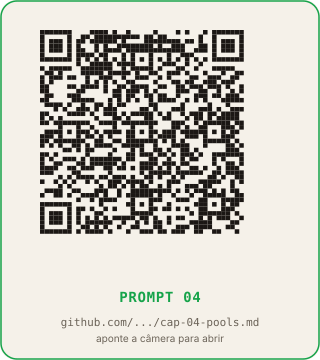
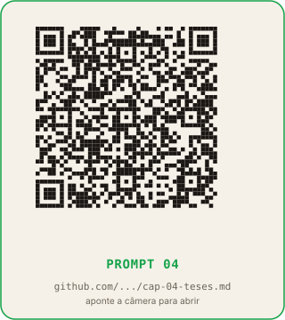

# Capítulo 4: Eixos, teses e pools de frases

**Tempo de leitura:** 16 min
**O que você sai sabendo:** como pedir para a IA escrever uma tese em uma frase para cada combinação de eixos, e um pool de 8 a 10 variações por slide em cada combinação, sem repetir frase.
**Token gasto neste capítulo:** zero na leitura; uma sessão longa de design com a IA quando você aplicar.

## Conceito

A copy da série não é escrita peça por peça. A copy é escrita **uma vez para cada combinação de eixos**, e cada item da série recebe uma variação da copy da sua combinação.

Três peças do mecanismo, em ordem:

1. **Eixos**: dois atributos do catálogo que definem as combinações (capítulo 3).
2. **Tese**: uma frase por combinação de eixos, dizendo a promessa central daquela combinação.
3. **Pools de frases**: 8 a 10 variações por slide em cada combinação, com um mecanismo determinístico (hash do id do item) para escolher qual variação cada item recebe.

O mecanismo parece complicado de escrever e trivial de rodar. A sessão de design é longa; a geração das 418 peças é instantânea.

## Por que uma tese por combinação

Sem uma tese amarrada, o slide 1 promete uma coisa, o slide 3 cita outra, o slide 8 fecha em uma terceira, e o leitor sai sem saber o que o carrossel estava vendendo. A tese é o que dá coerência à série inteira: cada peça fala uma coisa só, e a coisa que ela fala está alinhada com a categoria do item.

Para a série OpenRouter, as teses por tier (eixo 1) foram:

| Tier | Tese |
|---|---|
| free | Feature de IA a custo zero. Margem integral na entrega. |
| barato | Custo de centavos por milhão de tokens. A margem recorrente mora na diferença entre custo e mensalidade. |
| médio | Produtividade. A hora do time volta para o que vende. |
| caro | Entrega crítica com modelo de elite. Cliente paga pelo resultado, não pelo token. |

Cada tier tem um único argumento econômico. Os oito slides do carrossel pagam esse argumento em vocabulário de software house: proposta, módulo, setup, mensalidade, margem.

A combinação de tier + modalidade dá a tabela de teses para a copy. A copy da combinação `(barato, visão)` vai falar de feature de visão a custo baixo; a da combinação `(caro, código)` vai falar de entrega crítica com modelo de elite para programação.

## Por que 8 a 10 variações por slide

Se o pool de variações tem só 2 ou 3 frases por slide, e a série tem 418 itens, a repetição aparece. A série OpenRouter cometeu esse erro: um único exemplo de cena para modelos de visão. Resultado: 254 dos 418 carrosséis diziam "foto da nota fiscal" no slide 3.

A correção foi um pool de dez cenas por modalidade, cobrindo setores diferentes de cliente: nota fiscal, print de erro, currículo em PDF, canteiro de obra, contrato, planta baixa, boleto, exame médico, etiqueta de estoque, manual técnico. Depois da correção, a repetição sumiu.

Regra prática para o seu projeto: **pool menor que oito opções, numa série com mais de cem itens, vira repetição que o leitor nota**. Não escreva mais que 15 opções por slide (a IA começa a repetir argumentos). Entre 8 e 12 é o ponto certo.

## Como o item recebe a variação (sem sorteio)

Aqui mora o detalhe que diferencia o jeito 2 do jeito 1 com passes de prompt. A escolha da variação não é aleatória. Ela é determinística, baseada no id do item, igual a uma chave de gaveta: o mesmo item sempre abre a mesma gaveta.

O mecanismo, traduzido em linguagem de leigo:

1. Você pega o id do item (ex.: "alpha-3-5-vision").
2. Aplica uma função hash (uma fórmula matemática que transforma texto em número).
3. Divide o número pelo tamanho do pool (ex.: 10 variações → divide por 10).
4. O resto da divisão é o índice da variação que esse item recebe.

O efeito prático: o item 001 sempre recebe a variação 3, em qualquer execução, hoje ou daqui a dois anos. Quando você corrigir uma frase errada no pool, o item 001 continua recebendo a variação 3 (a frase corrigida), e os outros 417 itens continuam recebendo as suas variações originais. Você não precisa revisar 418 itens, e só o que estava errado.

No prompt-mestre do capítulo 7, a IA escreve o script Python (ou a fórmula do Sheets) que aplica o hash. Você não precisa entender a matemática, só pedir para a IA implementar e te entregar o resultado.

## Material necessário

- Conta gratuita ou paga em ChatGPT, Claude ou Gemini.
- A planilha do catálogo do capítulo 3 (com as colunas `categoria_1` e `categoria_2`).
- Bloco de notas ou Google Docs.

## Passo a passo

1. Abra o ChatGPT.
2. Cole o prompt 1 (abaixo). Espere a IA responder com a tabela de teses.
3. Leia as teses. Para cada combinação, pergunte a si mesmo: "Eu pagaria essa promessa se lesse no feed?" Se a resposta for "mais ou menos", peça outra tese: "Reescreva a tese para a combinação X com um argumento mais concreto."
4. Cole o prompt 2 (abaixo) com o resultado do prompt 1. Espere a IA responder com os pools de variações.
5. Para cada slide de cada combinação, confira se as 8 a 10 variações são realmente diferentes (não são paráfrases da mesma frase).
6. Copie as duas respostas para `fabrica-carrosseis/cap04`.

## Prompt 1 para colar na IA (teses por combinação)

```
Você é meu redator-chefe de uma série de carrosséis.

Minha série tem estes dois eixos de classificação:

  Eixo 1 (nome: [NOME, 
    ex: TIER_DE_PRECO]): valores possíveis
  [VALOR_1, VALOR_2, VALOR_3, VALOR_4].
  Eixo 2 (nome: [NOME, ex: MODALIDADE]): valores possíveis
  [VALOR_A, VALOR_B, VALOR_C, VALOR_D, VALOR_E, VALOR_F].

O público-alvo da série é [DESCREVA, ex: donos de software
house que precisam decidir qual modelo de IA usar].
O tom de voz é [TOM, ex: direto, sem jargão, com vocabulário
de gestão de software house].
O produto/serviço que estou vendendo com a série é
[PRODUTO/SERVIÇO].

Para CADA combinação dos dois eixos, me dê UMA tese em UMA
frase. Cada tese deve:
  - prometer uma coisa concreta para o leitor (não
    ser genérica);
  - caber em no máximo 200 caracteres;
  - usar vocabulário alinhado ao público e ao tom;
  - ser diferente das teses das combinações vizinhas (não
    bastar trocar uma palavra).

Apresente o resultado como uma tabela:

| Combinação | Tese (1 frase, até 200 caracteres) |
| --- | --- |
| (VALOR_1, VALOR_A) | ... |
| ... | ... |
```

## Prompt 2 para colar na IA (pools de variações)

```
Você é meu redator de copy para uma série de carrosséis.

A série tem a anatomia fixa de 8 slides:
  1. gancho (dor concreta que termina no nome do item)
  2. o_que_e (define e desarma a objeção técnica)
  3. pratica (cena de uso por modalidade)
  4. o_que_vender (bullets que viram linha de proposta)
  5. como_cobrar (monetização que fecha a conta do gancho)
  6. [NOME_PRODUTO] (preço real e link)
  7. benchmark (número real com leitura por faixa)
  8. cta (promessa do tier + chamada para ação)

Aqui está a tabela de teses por combinação:

  [COLE A TABELA DO PROMPT 1]

Para CADA combinação de eixos e para CADA slide (exceto o
slide 6, que tem preço fixo), gere um POOL de 8 a 10
variações.

Cada variação deve:
  - Caber em até [N, ex: 100] caracteres.
  - Conter 1 a 3 "trechos de destaque" (palavras ou 
    expressões
    curtas que viram negrito no post).
  - Ser semanticamente diferente das outras variações
    do pool
    (não ser paráfrase).
  - No slide 1 (gancho), 
    terminar no NOME do item (placeholder
    {{NOME}}). No slide 2 (o_que_e), abrir com "Esse é o
    {{NOME}}".
  - Usar vocabulário alinhado ao público e ao tom.

Formato de saída:

  Combinação: (VALOR_1, VALOR_A)
    Slide 1 - gancho:
      variação 1: texto | destaque: [...]
      variação 2: texto | destaque: [...]
      ... (8 a 10 variações)
    Slide 2 - o_que_e:
      ... (mesmo formato)
    ... até slide 8

  Combinação: (VALOR_1, VALOR_B)
    ...
```

(Os dois prompts completos, com exemplos preenchidos para o nicho de [TEMA], estão em `prompts/cap-04-teses.md` e `prompts/cap-04-pools.md` no repositório público.)

## O que conferir

- As teses são realmente diferentes entre combinações vizinhas? Compare a tese `(barato, visão)` com `(médio, visão)`. Se a única diferença é a palavra "barato" vs "médio", peça outra tese.
- Os pools têm 8 a 10 variações por slide? Se a IA gerou 4 ou 5, peça: "Preciso de no mínimo 8 variações por slide, e a IA deve variar os argumentos, não só as palavras."
- O gancho (slide 1) sempre termina em `{{NOME}}`? Se em alguma variação o nome não aparece, peça para corrigir. Sem o nome no gancho, a peça perde a ligação com o item.
- Os trechos de destaque são palavras ou expressões curtas? Se a IA marcou a frase inteira como destaque, peça para reduzir: "Só pode destacar 1 a 3 palavras por variação, não a frase toda."

## O que muda amanhã de manhã

Você vai abrir a planilha `02-copy` que está vazia e criar uma aba para cada combinação de eixos. Dentro de cada aba, criar oito colunas (uma por slide) e colar os pools de variações. O cabeçalho da aba é o nome da combinação (ex.: `(barato, visão)`). Quando a IA de código (capítulo 7) rodar sobre essa planilha, ela vai ler cada aba e gerar a copy de cada item cruzando o catálogo com os pools. Amanhã, a planilha tem o esqueleto das 24 combinações; depois da sua aprovação dos pools, ela passa a ser o contrato da série.

## QR codes dos prompts deste capitulo

Aponte a camera do celular para cada QR code ou clique no link para abrir o arquivo `.md` completo no GitHub. O arquivo contem o prompt destacado, variacoes para Claude e Gemini, exemplos preenchidos e o checklist de validacao.

### Prompt 04 (2/2) - Pools de variacoes



[Abrir no GitHub](https://github.com/bittencourtthulio/carrosseis-infinitos-com-qualquer-ia/blob/main/prompts/cap-04-pools.md)  
Arquivo: `prompts/cap-04-pools.md` no repositorio publico.

### Prompt 04 (1/2) - Teses por combinacao



[Abrir no GitHub](https://github.com/bittencourtthulio/carrosseis-infinitos-com-qualquer-ia/blob/main/prompts/cap-04-teses.md)  
Arquivo: `prompts/cap-04-teses.md` no repositorio publico.

