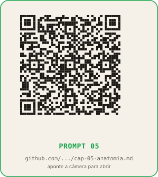
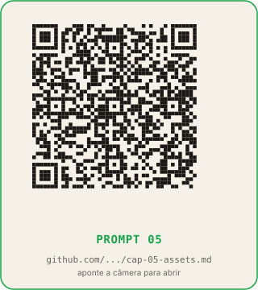

# Capítulo 5: Anatomia dos 8 slides como contrato (e os assets visuais)

**Tempo de leitura:** 16 min
**O que você sai sabendo:** por que fixar a anatomia dos 8 slides antes de gerar copy evita ter que regerar tudo; e como usar uma IA de imagem de ponta, uma única vez, para gerar os assets visuais do template que a fábrica inteira vai reutilizar.
**Token gasto neste capítulo:** zero na leitura; uma sessão longa de design (texto) e uma sessão única de geração visual (imagem) com a IA quando você aplicar.

## Conceito

A anatomia dos 8 slides é o contrato entre a copy (capítulo 4) e a imagem (capítulo 7). Definir a anatomia antes de gerar a copy é o que evita que você tenha que regerar tudo quando descobre que o slide 5 precisava ser diferente.

A anatomia fixa oito funções, uma por slide:

| Slide | Função | O que carrega | Print |
|---|---|---|---|
| 1 | gancho | Dor concreta que termina no nome do item | não |
| 2 | o_que_e | Define e desarma a objeção técnica | sim |
| 3 | pratica | Cena de uso por modalidade | sim |
| 4 | o_que_vender | Bullets que viram linha de proposta | não |
| 5 | como_cobrar | Monetização que fecha a conta do gancho | não |
| 6 | link | Preço real e link oficial | sim |
| 7 | benchmark | Número real com leitura por faixa | sim |
| 8 | cta | Promessa do tier + chamada para ação | não |

A função é o campo que o renderizador lê para escolher qual layout montar. Copy e layout se encontram nesse campo, e só nele.

## Por que a anatomia fixa

Três motivos concretos.

**1. Evita refação.** Se o slide 5 muda de função (era "como_cobrar", vira "garantia"), você muda a regra do slide 5 no template e regenera o lote. Sem anatomia fixa, cada peça tem a copy do slide 5 escrita de um jeito diferente, e a mudança vira refação manual de 418 peças.

**2. Permite que a copy seja revisável em código.** Com a anatomia fixa, a copy de cada slide mora em um campo nomeado (`slide_1_texto`, `slide_2_texto` etc.) na planilha do capítulo 4. Para revisar, você abre a planilha, edita o campo, regenera. Sem anatomia fixa, a copy é um texto corrido sem pontos de revisão.

**3. Permite trocar o visual sem trocar a copy.** Com a anatomia fixa, a identidade visual é uma camada separada da copy. Se você decidir mudar a cor de destaque ou o ícone do tier, mexe no template, não na copy. Sem anatomia fixa, a copy está entrelaçada com o visual e qualquer mudança vira refação.

## A sessão única de geração visual (com IA de imagem de ponta)

Aqui mora o investimento pesado do título, e ele acontece uma única vez.

A copy mora no texto. A imagem mora nos assets. Os assets são os arquivos visuais que o template usa em todas as peças: a imagem de capa, o ícone que representa o tier (free, barato, médio, caro), a moldura que aparece em volta do print, o detalhe de marca que vai no rodapé.

Esses assets precisam ter **qualidade alta** porque vão aparecer em todas as peças da série, e o leitor vai ver o mesmo asset repetido por semanas. É aqui que a IA de imagem de ponta (Midjourney, DALL-E, Imagen, Ideogram) entra.

**Esta é a única vez que você gasta tokens de imagem em volume.** Depois desta sessão, os assets viram arquivos na pasta `04-pngs/assets` e são reutilizados em todas as 418 peças. A geração em lote (capítulo 7) não chama modelo de imagem: ela usa Python para montar o PNG final combinando os assets com a copy.

A sessão de geração visual é única por **série** (não por peça). Se você mantiver a marca da Academia do Código / EXPX, os assets da próxima série reutilizam os mesmos ícones de tier, a mesma moldura, o mesmo detalhe de marca. A cada nova série você só precisa gerar a capa nova (1 imagem) e, eventualmente, um ícone novo se a categoria nova exigir.

## O que a IA de imagem vai produzir nesta sessão

A lista mínima de assets, em ordem de impacto:

1. **Capa da série** (1 imagem, 1080×1350 ou 1:1, depende do seu formato). É a primeira coisa que o leitor vê no feed.
2. **Ícone do tier** (4 ícones, um por valor do eixo preço). Pequenos, alto contraste, fundo transparente. Saem em PNG com canal alfa.
3. **Moldura do print** (1 imagem). Vai em volta dos slides 2, 3, 6 e 7 (os slides com print). Pode ser um traço, um canto dobrado, uma sombra, e algo que diferencia "isto é uma captura de tela" de "isto é copy".
4. **Detalhe de marca** (1 imagem, opcional). Logo ou símbolo no rodapé dos slides, menor que o ícone do tier.

Quatro a sete imagens no total. A sessão com a IA de imagem leva algumas horas (você vai gerar várias versões de cada, escolher a melhor, regenerar as que não ficaram boas). Quando você terminar, esses arquivos viram o "rosto" da série inteira.

## Material necessário

- Conta gratuita ou paga em ChatGPT, Claude ou Gemini (para o prompt-mestre da anatomia).
- Conta em uma IA de imagem de ponta (Midjourney, DALL-E, Imagen, Ideogram, Leonardo ou similar). Para esta sessão, vale a versão paga: a diferença de qualidade entre gratuita e paga se vê no feed.
- Editor de imagem gratuito para recortar e remover fundo dos ícones (Photopea no navegador, ou GIMP instalado).
- Pasta vazia `04-pngs/assets` para guardar os arquivos gerados.

## Passo a passo

### Parte 1: a anatomia (com IA de texto)

1. Abra o ChatGPT.
2. Cole o prompt abaixo.
3. Leia a resposta. A IA vai descrever os 8 slides com função, o que carrega, tom, e um exemplo de copy real para um item de exemplo.
4. Se algum slide tem função que você não entende, peça: "Me dê um exemplo de copy real para o slide N, com base no item X."
5. Copie a resposta para `fabrica-carrosseis/cap05-anatomia`.

### Parte 2: os assets visuais (com IA de imagem)

6. Abra a IA de imagem.
7. Para cada asset da lista (capa, 4 ícones, moldura, detalhe de marca), gere 3 a 5 versões.
8. Salve a melhor versão na pasta `04-pngs/assets/`, com nome claro (`capa-serie.png`, `icone-tier-free.png`, `moldura-print.png`).
9. Se precisar, use o Photopea ou o GIMP para recortar e remover fundo dos ícones.

## Prompt para colar na IA (anatomia dos 8 slides)

```
Você é meu diretor de arte de uma série de carrosséis.

Minha série tem a tese [TESE GERAL, ex: "Cada LLM é uma
ferramenta de receita diferente para software house"] e o
público-alvo [PÚBLICO, ex: donos de software house].

Os 2 eixos de classificação dos itens são:
  Eixo 1: [NOME] (valores: [LISTA])
  Eixo 2: [NOME] (valores: [LISTA])

Aqui está a tabela de teses por combinação:
  [COLE A TABELA DO CAPÍTULO 4]

Me dê a anatomia fixa dos 8 slides para esta série:

  Slide 1 - gancho:
    Função: ...
    O que carrega: ...
    Tom: ...
    Layout visual sugerido: ...
    Exemplo de copy real para o item "[ITEM EXEMPLO]" na
    combinação (VALOR_1, VALOR_A):
      "..."
      Destaques: [...]

  Slide 2 - o_que_e:
    ... (mesmo formato)

  ... (até slide 8 - cta)

Para cada slide, justifique em 1 frase por que essa função
existe na anatomia. Se algum slide parece redundante com
outro, aponte e sugira a fusão.

Termine com:
  - Lista dos assets visuais que precisam ser gerados para
    esta série (capa, ícones, molduras etc.).
  - Briefing de 1 parágrafo para cada asset, pronto para eu
    colar na IA de imagem.
```

## Prompt para colar na IA de imagem (capa da série)

```
[COLE O BRIEFING QUE O PROMPT ANTERIOR GEROU PARA A CAPA]

Acrescente no final do meu prompt:
  - Formato 1080x1350 (proporção 4:5 do Instagram).
  - Estilo visual: [ESTILO, ex: minimalista, com tipografia
    geométrica, paleta verde EXPX #16A34A + creme #F5F1E9].
  - Sem texto corrido na imagem (o texto vai ser inserido
    depois pelo template).
  - Sem fotos de pessoas, sem logotipos de empresas reais,
    sem cara de banco de imagem.
  - Resultado final: alto contraste, legível em miniatura no
    feed, com espaço livre no centro para o título ser
    sobreposto.
```

(Os prompts completos, com briefings prontos para capa, 4 ícones de tier, moldura e detalhe de marca, estão em `prompts/cap-05-anatomia.md` e `prompts/cap-05-assets.md` no repositório público.)

## O que conferir

- A anatomia dos 8 slides cobre gancho, definição, prática, venda, monetização, link, prova e CTA? Se algum desses oito falta, peça para incluir. Se algum parece redundante, peça fusão.
- O exemplo de copy de cada slide cita o item de exemplo pelo nome e bate com a tese da combinação? Se não bate, peça para ajustar.
- Os assets visuais ficaram com fundo transparente (ícones) ou fundo limpo (capa)? Se o ícone do tier saiu com fundo branco quadrado, ele vai aparecer como um quadrado em volta do ícone nas peças. Remova o fundo antes de salvar.
- A capa ficou legível em miniatura? Abra o feed do Instagram e veja se a capa é reconhecível a 200×300 pixels. Se não é, peça mais contraste.

## O que muda amanhã de manhã

Você vai abrir a pasta `04-pngs/assets/` e confirmar que os sete arquivos estão lá (capa, 4 ícones, moldura, detalhe de marca). Cada arquivo com nome claro e fundo transparente onde precisa. Amanhã, quando a IA de código (capítulo 7) for escrever o script de geração, o primeiro passo do script vai ser "carregar os assets desta pasta". A fábrica já tem o rosto.

## QR codes dos prompts deste capitulo

Aponte a camera do celular para cada QR code ou clique no link para abrir o arquivo `.md` completo no GitHub. O arquivo contem o prompt destacado, variacoes para Claude e Gemini, exemplos preenchidos e o checklist de validacao.

### Prompt 05 (1/2) - Anatomia dos 8 slides



[Abrir no GitHub](https://github.com/bittencourtthulio/carrosseis-infinitos-com-qualquer-ia/blob/main/prompts/cap-05-anatomia.md)  
Arquivo: `prompts/cap-05-anatomia.md` no repositorio publico.

### Prompt 05 (2/2) - Briefing para IA de imagem



[Abrir no GitHub](https://github.com/bittencourtthulio/carrosseis-infinitos-com-qualquer-ia/blob/main/prompts/cap-05-assets.md)  
Arquivo: `prompts/cap-05-assets.md` no repositorio publico.

