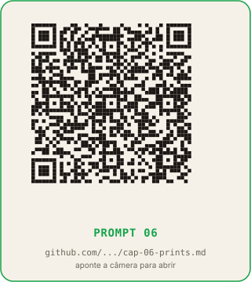

# Capítulo 6: Prova visual em escala: 4 prints por carrossel

**Tempo de leitura:** 13 min
**O que você sai sabendo:** como capturar os 1.672 prints (4 por item) que sustentam a copy da série, sem confiar em prompt, e como conferir que cada print bate com o slide em que vai aparecer.
**Token gasto neste capítulo:** zero na leitura; uma sessão curta de organização quando você aplicar.

## Conceito

Copy sem prova é opinião. A série OpenRouter exige quatro prints por carrossel: a tela principal do produto, a funcionalidade em uso, o preço na página oficial e um benchmark ou prova social.

O print é o que diferencia "falam do modelo" de "mostram o modelo". O leitor confia mais em imagem do que em texto. Um print correto vale por dez parágrafos de copy.

Aqui entra uma distinção importante: **a captura de prints não usa IA de geração**. Você não chama Midjourney para "inventar" uma tela do produto. Você captura a tela real. A única IA que entra aqui é a de texto, escrevendo um script Python (capítulo 7) que automatiza a captura em escala. A geração visual (capítulo 5) é para o template; a captura é para a prova.

## A regra que vem antes da ferramenta: print pedido é print obrigatório

Se o slide pede print no contrato (capítulo 5), o print tem que existir antes de publicar. O renderizador avisa e renderiza só texto, o que serve para ajustar a copy, não para postar.

A série original tinha um catálogo de prints (`prints-catalog.json`) que era regenerado depois de cada captura em lote. O catálogo servia para o renderizador saber, antes de montar cada peça, se o print existia ou não. Sem catálogo atualizado, o renderizador confiava na descrição do campo `print` da copy e abria a peça sem a imagem.

Regra prática para o seu projeto: **o inventário de prints mora em uma planilha `03-prints/index`**, com uma linha por item da série e colunas para cada um dos quatro prints pedidos (tela, funcionalidade, preço, benchmark). O valor da célula é o caminho do arquivo (ex.: `001-alpha/tela.png`) ou `faltando` se a captura falhou.

## A cadeia de URLs alternativas

A captura em escala esbarra em três problemas clássicos, em ordem de frequência:

1. **A página principal do produto mudou de URL** (reorganização de site, migração para subdomínio). Solução: ter uma cadeia de URLs candidatas.
2. **A página existe mas bloqueia headless** (detecta bot e mostra CAPTCHA). Solução: ter uma URL alternativa que não bloqueia (por exemplo, o model card no Hugging Face em vez do site oficial).
3. **O print capturado mostra uma versão promocional fora de pico** (preço promocional que não vai se sustentar). Solução: empilhar cabeçalho com a tabela de preços, em vez de capturar a página de preço isolada.

A série OpenRouter usava a cadeia `site oficial → model card no Hugging Face → página do OpenRouter` para cada print. Se a primeira respondia 200, capturava; se não, tentava a segunda; e assim por diante.

Para a sua série, a cadeia depende do domínio. Para SaaS, pode ser `site oficial → página no Product Hunt → review em site terceiro`. Para ferramentas de IA, `site oficial → Hugging Face → OpenRouter`. Para livros, `site da editora → Amazon → Goodreads`.

## A checagem HTTP antes de abrir a página

O script de captura (que a IA de código escreve no capítulo 7) faz uma chamada HEAD na URL antes de abrir o browser. Se o retorno for 404, 403 ou timeout, pula para a próxima URL da cadeia. Nenhum print de erro fica no disco.

A checagem HTTP também serve para detectar rate limit: se o site bloqueia após N capturas, o script espera 60 segundos e tenta de novo, em vez de gerar 200 prints quebrados.

## Recorte com margem (não print full page)

O print full page pega o site inteiro, incluindo header, footer, banners laterais e cookie consent. O slide só precisa do conteúdo central, com margem nas bordas.

O script de captura recorta com PIL (a biblioteca de imagem do Python) por slide, deixando uma margem configurável (em pixels) em cada lado. Para 1080×1350 com print central de 800×600, sobram 140px de margem por lado, espaço suficiente para o texto do slide respirar.

## O modo recheck: apagando prints que morreram

Sites mudam. Prints que eram válidos na semana passada podem mostrar agora uma página 404, um rebranding, ou um banner de "site em manutenção". O modo recheck é uma varredura periódica: para cada print já capturado, abre a URL original, confere se ainda responde 200, e apaga o print se a URL morreu.

A frequência recomendada para o recheck é semanal, no mesmo dia em que você agenda os posts. Se você posta de segunda a sexta, o recheck de sexta pega os problemas antes do fim de semana.

## Material necessário

- Conta gratuita ou paga em ChatGPT, Claude ou Gemini (para escrever o script de captura).
- Acesso à planilha `catalogo-[sua-serie]` do capítulo 3.
- Pasta vazia `03-prints` no Google Drive ou no seu computador.
- Extensão de Chrome gratuita (GoFullPage ou FireShot) para a captura manual de itens-piloto.

## Passo a passo

### Parte 1: mapeamento manual dos 10 primeiros itens

1. Pegue os 10 primeiros itens do catálogo do capítulo 3.
2. Para cada item, abra o site oficial no Chrome.
3. Capture os 4 prints pedidos (tela principal, funcionalidade, preço, benchmark) usando a extensão.
4. Salve em `03-prints/001-primeiro-item/tela.png`, `funcionalidade.png`, `preco.png`, `benchmark.png`.
5. Repita para os 9 itens seguintes, ajustando a pasta para `002-segundo-item` etc.
6. Anote quanto tempo levou para capturar 40 prints (10 itens × 4 prints). Esse número é a estimativa de tempo para o lote manual, antes de você pedir o script automatizado.

### Parte 2: pedido do script para a IA

7. Abra o ChatGPT.
8. Cole o prompt abaixo, incluindo a estrutura de pastas que você acabou de criar para os 10 itens-piloto.
9. Leia o script que a IA escreveu. Mesmo que você não entenda Python, veja se ele faz as 5 coisas da seção "O que conferir" abaixo.
10. Cole o script no Google Colab e rode sobre os 10 itens-piloto. Confira se os prints gerados pelo script batem com os prints manuais.
11. Se baterem, rode sobre os 408 itens restantes. Você acabou de capturar 1.672 prints.

## Prompt para colar na IA

```
Você é meu engenheiro de captura de imagens em escala.

Preciso capturar 4 prints por item para uma série de [N, ex:
418] carrosséis. Cada item tem 4 prints:

  tela.png (tela principal do produto ou serviço)
  funcionalidade.png (funcionalidade em uso)
  preco.png (página de preço oficial)
  benchmark.png (número ou prova social)

Minha planilha de catálogo está em
[URL_DO_GOOGLE_SHEETS] e tem as colunas [LISTA]. A coluna
[NOME_DA_COLUNA_DE_URL, ex: url_oficial] tem a URL principal
de cada item.

A cadeia de URLs alternativas para cada print é:
  Tela principal: [URL_PRINCIPAL] → [URL_ALTERNATIVA_1] →
  [URL_ALTERNATIVA_2]
  Funcionalidade: [URL_PRINCIPAL] → [URL_ALTERNATIVA_1]
  Preço: [URL_PRINCIPAL] → [URL_ALTERNATIVA_1]
  Benchmark: [URL_PRINCIPAL] → [URL_ALTERNATIVA_1]

Me escreva um script Python que:

  1. Lê a planilha do Google Sheets (use a biblioteca
    gspread
     ou similar).
  2. Para cada item, tenta cada URL da cadeia, na ordem, com
     uma chamada HEAD antes de abrir a página.
  3. Se a URL responde 200, 
    abre a página em browser headless
     (use Playwright).
  4. Captura o conteúdo central, com margem de [N, ex: 100]
     pixels em cada lado.
  5. Salva em pasta local no formato:
     [ID_DO_ITEM]/[FUNCAO_DO_PRINT].png
     Exemplo: 001-alpha-3-5/tela.png
  6. Atualiza a planilha catálogo com o status de cada print
     (capturado / faltando / URL morta).

Termine com:
  - Lista de bibliotecas Python que o script usa.
  - Como rodar no Google Colab (sem instalar nada).
  - Como rodar o modo recheck (varredura que apaga prints
    cuja URL morreu).
```


**QR code do prompt:**



[Abrir no GitHub](https://github.com/bittencourtthulio/carrosseis-infinitos-com-qualquer-ia/blob/main/prompts/cap-06-prints.md)

(O prompt completo, com instruções de uso e variações para Claude e Gemini, está em `prompts/cap-06-prints.md` no repositório público.)

## O que conferir

- O script tenta cada URL da cadeia antes de desistir? Se o script só tenta a URL principal e pula para o próximo item quando falha, peça para adicionar a cadeia.
- O script faz HEAD antes de abrir o browser? Sem o HEAD, o script gasta tempo abrindo páginas que vão dar 404.
- O script salva no formato `[id]/[funcao].png`? Sem padronização, os prints ficam espalhados.
- O script atualiza a planilha catálogo com o status? Sem atualização, o renderizador do capítulo 7 não sabe quais prints existem.
- O modo recheck está implementado? Sem recheck, prints que morreram ficam na pasta até alguém perceber.

## O que muda amanhã de manhã

Você vai abrir a pasta `03-prints/` e confirmar que tem subpastas para os primeiros 10 itens, com 4 prints em cada. Amanhã, quando rodar o script no Colab, ele vai gerar as outras 408 subpastas em alguns minutos de CPU, e a pasta `03-prints/` passa a ter 418 subpastas com 1.672 arquivos. O inventário na planilha catálogo vai mostrar `capturado` em quase todas as linhas, com `faltando` apenas onde a cadeia inteira de URLs morreu (esses itens precisam de captura manual ou de exclusão da série).

## QR codes dos prompts deste capitulo

Aponte a camera do celular para cada QR code ou clique no link para abrir o arquivo `.md` completo no GitHub. O arquivo contem o prompt destacado, variacoes para Claude e Gemini, exemplos preenchidos e o checklist de validacao.

### Prompt 06 - Captura de prints em escala


[Abrir no GitHub](https://github.com/bittencourtthulio/carrosseis-infinitos-com-qualquer-ia/blob/main/prompts/cap-06-prints.md)  
Arquivo: `prompts/cap-06-prints.md` no repositorio publico.

