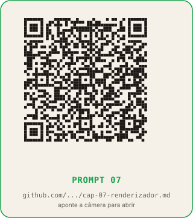

# Capítulo 7: Renderizar sem surpresas: copy vira imagem

**Tempo de leitura:** 17 min
**O que você sai sabendo:** como pedir para a IA de texto escrever o script Python que gera os 3.344 PNGs (418 itens × 8 slides) a partir da copy e dos assets, como rodar esse script no Google Colab sem instalar nada, e como detectar e corrigir os slides que estouraram.
**Token gasto neste capítulo:** zero na leitura; uma sessão curta de ajuste por amostra e uma rodada de geração em lote quando você aplicar.

## Conceito

Este é o capítulo que transforma copy em imagem. O trabalho que o Canva faz para uma peça, o Python faz para 418 peças, e desde que a IA tenha escrito o script certo.

A geração em lote é onde mora a maior parte da "mágica" do jeito 2. Aqui, todo o trabalho das etapas anteriores (catálogo, copy, teses, pools, anatomia, assets, prints) converge: a IA de texto leu tudo, escreveu um script Python, e o script lê a planilha do capítulo 4 e a pasta de assets do capítulo 5, monta cada um dos 3.344 slides, e salva os PNGs.

**Importante:** a geração em lote não chama modelo de IA nenhum. O Python lê a planilha, lê os arquivos de imagem da pasta `04-pngs/assets/`, monta o PNG combinando texto e imagem, e salva. Zero token. CPU pura.

## O loop de ajuste k (por que o browser mede o que o código não adivinha)

Aqui mora o mecanismo que faz a fábrica funcionar sem revisão slide a slide.

Cada slide tem tamanho fixo (1080×1350) e elementos com tamanhos variáveis (texto da copy, tamanho do print). Se a copy ficou maior que o espaço disponível, o texto estoura o slide. Se a copy ficou muito menor, sobra espaço em branco.

O que o loop `k` faz:

1. O script monta o slide com fator de escala `k = 1.0` (tamanho normal).
2. Depois de montar, o script abre o slide no Chromium (via Playwright) e mede a altura real do conteúdo com JavaScript (`element.scrollHeight`).
3. Se o conteúdo estourou o limite (slide estourou, card estourou, lista estourou), o script reduz `k` em 4% (vira 0.96) e remonta.
4. Repete até 14 vezes. Se não couber nem com 14 reduções, o script marca o slide como "estourou" no log.
5. Para slides de card com espaço sobrando, o script faz o caminho contrário: aumenta `k` em 4% por rodada, até 1.25, e fica no maior valor que ainda passa.

O resultado é um slide que cabe, sem texto cortado, sem espaço vazio excessivo. E o log de cada slide diz qual foi o `k` final, então em vez de abrir os 3.344 PNGs você abre só os que tiveram `k < 0.85` ou aviso de 14 rodadas.

| Valor de `k` | Significado | Ação |
|---|---|---|
| 1.00 | coube sem ajuste | nenhuma |
| acima de 1.00 | sobrou espaço, texto cresceu | nenhuma |
| 0.85 a 0.96 | texto ou print grande, encolheu sozinho | nenhuma |
| abaixo de 0.85 | copy comprida ou print alto demais | encurtar copy ou recortar print |
| aviso de 14 rodadas | não coube nem encolhendo | encurtar copy |

## Como rodar Python sem instalar nada: Google Colab

O Google Colab é um ambiente Python que roda no navegador, gratuito, e que já vem com a maioria das bibliotecas instaladas (Playwright, Pillow, gspread). Você não instala nada. Você abre `colab.research.google.com`, cria um notebook novo, cola o script numa célula, aperta o botão de play.

Vantagens do Colab para este caso:

- Não exige instalação local (Python, pip, virtualenv).
- O ambiente é padronizado: o script que roda no Colab roda igual em qualquer máquina.
- A sessão é gratuita, com limite de tempo generoso (várias horas) e possibilidade de upgrade pago se a série for muito grande.
- Os arquivos ficam no Google Drive associado à sua conta, então você não precisa gerenciar download.

Limitação: a sessão do Colab expira depois de algumas horas de inatividade, então para lotes muito grandes (acima de 1.000 slides) você pode precisar rodar em pedaços, salvando o progresso a cada 100 peças.

## Os três caminhos de renderização

A copy pode virar PNG de três formas, em ordem de recomendação:

**Caminho A (recomendado): script Python no Google Colab.** É o caminho deste capítulo. A IA de texto escreve o script, você cola no Colab, aperta play, e o Python gera os 3.344 PNGs. Zero token depois da escrita do script. Mais rápido, mais consistente, mais barato em escala.

**Caminho B: Canva com template + download em lote.** Para quem não quer ver Python nem de longe. Você monta o template no Canva manualmente, usa a função "duplicar página" para criar as 418 peças, ajusta o texto de cada uma (com ctrl+V em massa da planilha), e exporta os PNGs em lote pelo Canva Pro. Mais lento (algumas horas de clique manual), mas 100% sem código.

**Caminho C: Google Slides com macro do Apps Script.** Caminho intermediário. Você monta o template no Google Slides, escreve uma macro em Apps Script (a linguagem de script do Google) que preenche os slides a partir de uma planilha, e exporta como PNG via Google Drive. Não é exatamente "sem código", mas a macro é curta e a IA escreve para você.

O prompt abaixo pede o caminho A. Se você quiser B ou C, peça no mesmo chat: "Reescreva para o caminho B (Canva puro)" ou "Reescreva para o caminho C (Apps Script)".

## Material necessário

- Conta gratuita ou paga em ChatGPT, Claude ou Gemini.
- Conta Google (para acessar o Colab e o Drive).
- A planilha `02-copy` do capítulo 4.
- A pasta `04-pngs/assets/` do capítulo 5 (com capa, 4 ícones, moldura, detalhe de marca).
- Conexão à internet.

## Passo a passo

### Parte 1: ajuste por amostra (gerar 3 peças, conferir, ajustar prompt)

1. Pegue 3 itens do catálogo: um claro, um escuro, e um com provider de cor difícil (ex.: preto no tema escuro, que era invisível).
2. Abra o ChatGPT.
3. Cole o prompt abaixo. Preencha os campos entre colchetes.
4. Copie o script que a IA respondeu.
5. Abra `colab.research.google.com`, crie um notebook novo.
6. Cole o script na primeira célula.
7. Na segunda célula, escreva o comando para rodar apenas os 3 itens: `!python main.py --itens 1,2,3`
8. Aperte play.
9. Veja os 24 PNGs gerados (3 itens × 8 slides).
10. Para cada peça, confira: a copy cabe? o print aparece? a cor de destaque está visível? o CTA está no lugar?
11. O que estiver errado, anote e peça para a IA ajustar o script: "No slide 5, o CTA está sobrepondo o rodapé. Ajuste a posição."
12. Repita até os 3 itens passarem sem erro.

### Parte 2: geração do lote

13. Rode o mesmo script, agora sem o filtro `--itens`: `!python main.py`
14. Espere o Colab terminar. Para 418 itens, leva entre 30 minutos e 2 horas, dependendo do tamanho da fila.
15. Baixe os 3.344 PNGs para a pasta `04-pngs/`.
16. Abra o log gerado pelo script. Filtre por `k < 0.85` ou por aviso de 14 rodadas. Para esses slides, revise a copy ou o print conforme o capítulo 9.

## Prompt para colar na IA

```
Você é meu engenheiro de geração de imagens em lote.

Preciso gerar [N, ex: 418] × 8 = [TOTAL, ex: 3344] PNGs no
formato 1080x1350 (proporção 4:5 do feed do Instagram). Cada
PNG é um slide de um carrossel.

Os 8 slides, por função, são:
  1. gancho
  2. o_que_e (com print)
  3. pratica (com print)
  4. o_que_vender (lista de bullets)
  5. como_cobrar
  6. link (com print do preço)
  7. benchmark (com print do número)
  8. cta (caixa de destaque)

A copy de cada item está na planilha
[URL_DO_GOOGLE_SHEETS_COM_A_COPY], com uma linha por item e
colunas nomeadas:
  - slide_1_texto, slide_1_destaques
  - slide_2_texto, slide_2_destaques, slide_2_print
  - ... (até slide 8)
  - template (claro ou escuro, alternando pelo id)
  - provider_color_hex (cor de destaque do item)

Os assets visuais estão na pasta `04-pngs/assets/`:
  - capa-serie.png (1080x1350)
  - icone-tier-free.png, icone-tier-barato.png,
    icone-tier-medio.png, icone-tier-caro.png
  - moldura-print.png
  - detalhe-marca.png

O template visual tem dois temas (claro e escuro), com
variáveis CSS equivalentes a:
  Claro:  --bg #F5F1E9, --txt #1B1714, --muted #6B6358,
          --acc #16A34A, --hl #15803D
  Escuro: --bg #141210, --txt #F1EBE1, --muted #A69D8F,
          --acc #16A34A, --hl #22C55E

Me escreva um script Python que:

  1. Lê a planilha de copy via gspread.
  2. Para cada item da série:
     a. Monta o HTML dos 8 slides, 
    com base na função de cada
        slide e nos assets da pasta.
     b. Aplica o tema claro ou escuro conforme o campo
        `template` da planilha.
     c. Aplica a cor de destaque do item no campo --acc, com
        ajuste automático se o contraste com --bg for
        menor que 3:1 (clareia até 3:1, sem trocar o matiz).
     d. Abre o HTML no Chromium via Playwright em modo
        headless.
     e. Mede a altura real do slide com JavaScript injetado:
          const bad = [];
          if (slide.scrollHeight > 1351)
              bad.push('estourou');
          // outras checagens que você considerar
     f. Se estourou, reduz fator k em 4% e remonta (até 14
        vezes).
     g. Se sobrou espaço (>80px), 
    aumenta k em 4% (até 1.25).
     h. Salva screenshot do slide em PNG, no caminho
        `04-pngs/[ID_DO_ITEM]/slide_[N].png`.
  3. Loga cada slide com: id, função, k final, badges de
     estouro.
  4. Aborta com erro se a fonte não carregou
     (document.fonts.ready precisa resolver).
  5. Reutiliza o browser entre itens (não abre Chromium por
     peça).

Termine com:
  - Comando para rodar no Google Colab, célula por célula.
  - Como gerar apenas 3 itens-piloto (para teste).
  - Como ler o log e filtrar slides problemáticos.
```


**QR code do prompt:**



[Abrir no GitHub](https://github.com/bittencourtthulio/carrosseis-infinitos-com-qualquer-ia/blob/main/prompts/cap-07-renderizador.md)

(O prompt completo, com instruções de uso e variações para Claude e Gemini, está em `prompts/cap-07-renderizador.md` no repositório público.)

## O que conferir

- O script lê a planilha via gspread (não manualmente)? Se a IA pedir para você colar a planilha no script, peça para usar gspread.
- O script monta o HTML e renderiza com Playwright? Se a IA sugerir Pillow puro (desenho por código), peça para usar Playwright, que respeita o template HTML/CSS.
- O loop `k` tem ambos os caminhos (encolher e crescer)? Se só tem o caminho de encolher, peça para adicionar o de crescer.
- O script aborta se a fonte não carregou? Sem essa proteção, o lote inteiro sai com a fonte errada.
- O log tem `k` por slide? Sem o `k`, você vai ter que abrir os 3.344 PNGs.
- O modo "gerar apenas alguns itens" existe? Sem isso, o teste de 3 peças demora o mesmo tempo que o lote inteiro.

## O que muda amanhã de manhã

Você vai abrir `04-pngs/` e ver os 3.344 PNGs. Em vez de conferir um por um, abra o log do script, filtre por `k < 0.85` ou por aviso, e revise só esses. Em uma série bem desenhada, são menos de 50 slides para revisão humana. Depois, os slides limpos vão para o publicador do capítulo 8.

## QR codes dos prompts deste capitulo

Aponte a camera do celular para cada QR code ou clique no link para abrir o arquivo `.md` completo no GitHub. O arquivo contem o prompt destacado, variacoes para Claude e Gemini, exemplos preenchidos e o checklist de validacao.

### Prompt 07 - Renderizador em lote


[Abrir no GitHub](https://github.com/bittencourtthulio/carrosseis-infinitos-com-qualquer-ia/blob/main/prompts/cap-07-renderizador.md)  
Arquivo: `prompts/cap-07-renderizador.md` no repositorio publico.

